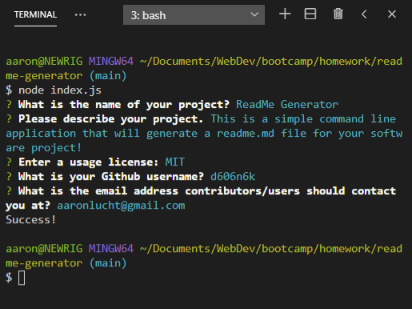

# readme-generator 

## Description
This is a simple command line application that will generate a readme.md file for your software project!
## Table of Contents (Optional)
- [Installation](#installation)
- [Usage](#usage)
- [Credits](#credits)
- [License](#license)

## Badges

## Installation
   
Run `npm i` in the command line terminal.
    
## Usage
    
Run `node index.js` in the terminal to be prompted with questions for your readme file!
    
Here is a quick video guide: https://youtu.be/ayl8uqiXHXU
    
## Credits
    
Created by [d606n6k](https://github.com/d606n6k)
    
## License
License: MIT

## Features
- Easy to read command line prompts for easy Readme generation

## How to Contribute
If you would like to contribute to this project, please fork the project as needed.

## Questions
Have any questions for the author? Contact this author via [Email](mailto:aaronlucht@gmail.com)

Check out the author's [Github](https://github.com/d606n6k)

## Tests
To run tests, run the following command:
`npm test` in the terminal